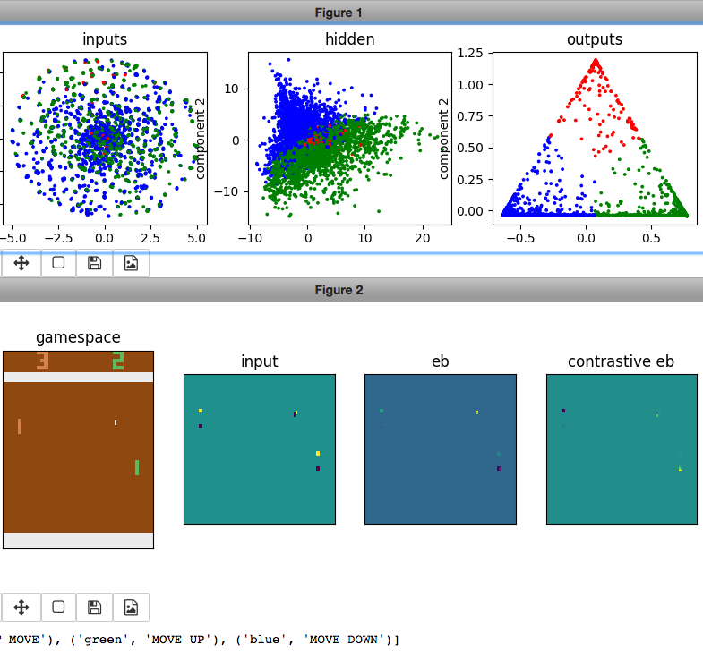

Papers
=======
Sam Greydanus. 2017. MIT License.

* [saliency.ipynb](https://nbviewer.jupyter.org/github/greydanus/papers/blob/master/saliency.ipynb)

About
--------

This repo contains papers for my work with the [Explainable AI (XAI) Project](http://twitter.com/DARPA/status/872547502616182785) at the Oregon State University College of Engineering. The XAI Project is supported by a grant from DARPA.

The idea is to make a thorough survey of saliency methods in the machine learning community, in particular 1) those that can be used on recurrent models and 2) those that can be used to explain deep RL models.

We hope to build on these works to create better explanations/interpretations of deep RL agents. As an example, here is a visualization I made of the policy of an Atari Pong policy:

